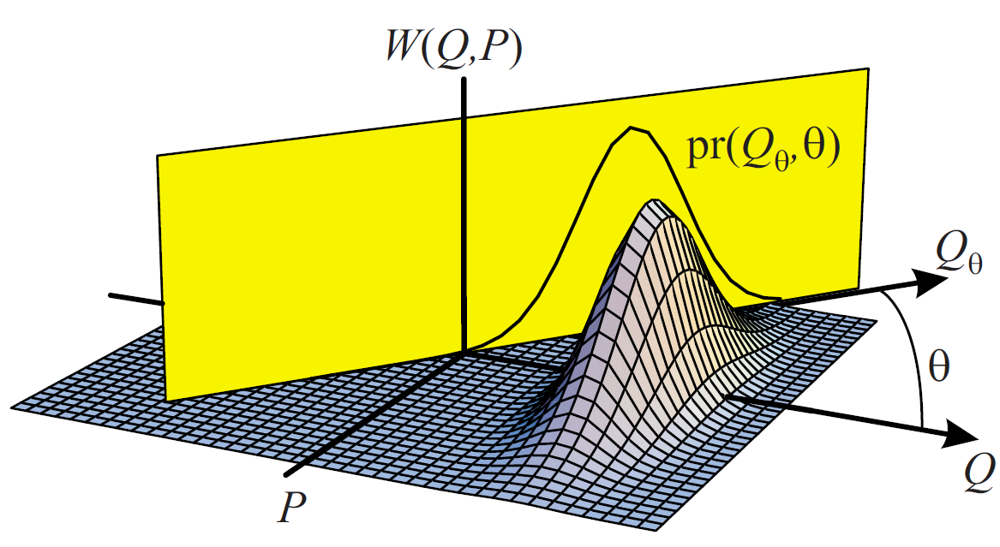
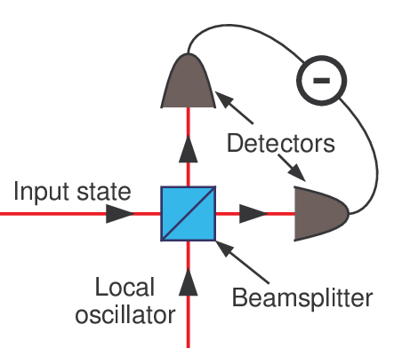

# Homodyne Tomograpy

This repository contains code for a Homodyne Tomography project in the DTU course 10387: Scientific Computing in Quantum Information Science.

Authors: Thomas Borup Ravnborg and Jan Scarabelli Calopa

## What is Homodyne tomography?

Homodyne tomography is a method for reconstructing quantum states of light by measuring field quadratures $Q_\theta$ at different local oscillator (LO) phases $\theta$ using a Homodyne detection scheme. From these measurements, one can recover the Wigner function $W(Q,P)$ and density matrix $\rho$, which makes it a key tool for verifying the preparation of nonclassical states in quantum optics.

In the paper *Optical Continuous-Variable Qubit* (see references), superpositions of squeezed vacuum and squeezed single-photon states were engineered using photon subtraction. The setup employed an optical parametric oscillator (OPO) to generate squeezed vacuum, a small fraction of which was tapped off, displaced, and detected by an avalanche photodiode (APD). Conditional detection prepared the desired superpositions, which were then analyzed using balanced homodyne detection across multiple LO phases.

In this notebook, we work with the experimental data obtained using this setup. Our goal is to benchmark and compare two different reconstruction methods - Maximum Likelihood Estimation (MLE) and Bayesian Mean Estimation (BME) - to reproduce the Wigner functions reported in the paper.

## Download and use instructions

1. Clone this repository using '$ git clone https://github.com/ThomasRavnborg/Homodyne-Tomography.git'

2. Download data-tora folder from [here](https://www.dropbox.com/scl/fi/0cb9i9vx9w0b1lpro8wpq/data-tora.zip?rlkey=nkouczz7r9ylnmkd3n639z7kt&dl=0). Put this into the data folder in the repo.

3. Open the notebook main.ipynb in the code folder and run it.
